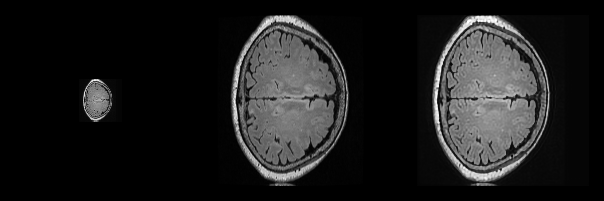
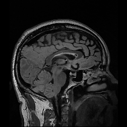
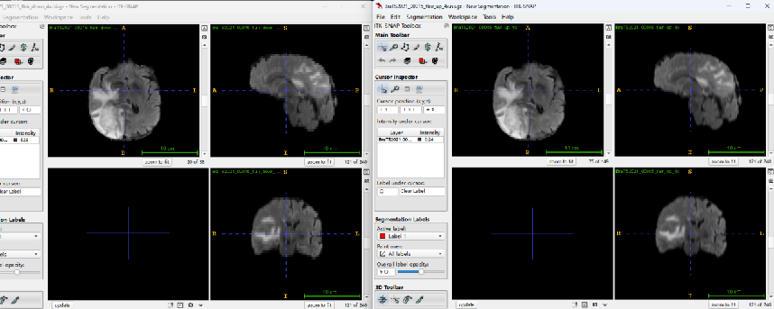

## DASR

    Unsupervised Degradation Representation Learning for Blind Super-Resolution

    训练数据集：

    **HR**:6000张flair大脑切片 

    **LR**:由HR经过随机退化生成

    测试图像来自同一3Dflair，但是不是训练数据,退化方式是real-esrgan复杂退化

    迭代400轮

    LR  HR   SR

    ---

    PSNR 19.86

    

    

    PSNR 20.63

    

    

    PSNR 20.36

    

    

    PSNR 24.44

    

    

    PSNR 20.38

    

    [DASR.zip](有结果的模型+22857b6d-b8e8-479b-bbb6-4cc0e8c187c5/DASR.zip)

## BliMSR

    训练数据集：

    **HR**:6000张flair大脑切片 

    **LR**:由HR经过Real-RSRGAN生成

    原代码只能训练128→512

    测试图像来自同一3Dflair，但是不是训练数据,退化方式也是real-esrgan复杂退化

    

    LR  HR   SR

    ---

    PSNR 25.42

    

    

    PSNR 24.07

    

    

    PSNR 23.84

    

    

    PSNR 24.28

    

    

    PSNR 25.15

    

    

    [test_data.zip](有结果的模型+22857b6d-b8e8-479b-bbb6-4cc0e8c187c5/test_data.zip)

## MLINR

    Super-resolution biomedical imaging via reference-free statistical implicit neural representation

    原图

    

    

    平均模糊，两倍下采样,使用两种偏移

    

    

    迭代5000次,PNSR=32.11
SSIM=0.965

    

    迭代10000次，PNSR=32.51,SSIM=0.968

    

    迭代5000次大概需要10分组。

## SRO

    Super-Resolution Neural Operator

    作者实验中使用的数据以及下采样方式和LIFE一样，也都是自然图像数据集，将HR图像随机分块，用双三次下采样退化。损失函数是HR和SR图像的L2损失。为了让代码适应MRI图像，我把卷积的输入输出通道改成1，分块大小从120改成了40，加入了标准归一化。

    

    
HR图像

    
HR图像双三次插值四倍下采样再上采样，PNSR 31.23

## ARSSR

    An Arbitrary Scale Super-Resolution Approach for 3D MR Images via Implicit Neural Representation

    训练数据和原文的任务一一样，使用HCP-1200脑部数据集
测试数据集使用BraTS2020数据集中的Flair序列数据，用高斯模糊进行2倍下采样，再用训练好的模型进行上采样。

    

    左边原图，右边结果

    

    

## MCSR

    Single-subject Multi-contrast MRI Super-resolution via Implicit Neural Representations

    使用的数据和原文一模一样，BraTS19

    上面是超分结果，下面是原始的两个序列

    

    

## SA-INR

    Spatial Attention-based Implicit Neural Representation for Arbitrary Reduction of MRI Slice Spacing

    选择一个数据分别以2，4，8倍下采样后再用训练的模型上采样

    

    
原图

    
两倍下采再上采

    

    
四倍下采再上采

    

    
八倍下采再上采

    

    

