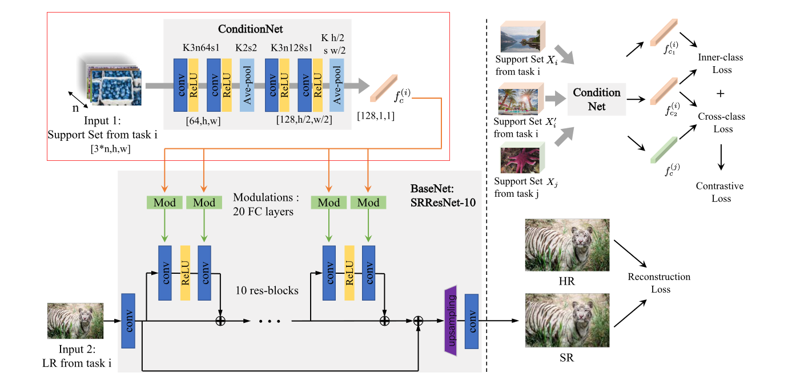

#  工作日志 2024.4.14

### Conditional Hyper-Network for Blind Super-Resolution With Multiple Degradations 

IEEE Transactions on Image Processing（2022）

作者提出了两个挑战：

1. 提出一个框架处理多种退化，既然我们无法精确的估计退化
2. 网络可以自适应的调整参数去适应哪些未知的退化

运嘉师兄说可以把对比学习模块换成直接的分类模块，效果可以更加直观的显示出来

运嘉师兄给我推荐了一篇论文

[CVPR 2024 | 超越Dropout：通用图像超分辨率的有趣解决方案 - 知乎 (zhihu.com)](https://zhuanlan.zhihu.com/p/685325490)

这是学习盲超分同一张图像不同退化一致性的论文。也许可以结合Conditional Hyper-Network for Blind Super-Resolution With Multiple Degradations 的一致性来做一些事情。同时学习一致性和不一致性

Conditional Hyper-Network for Blind Super-Resolution With Multiple Degradations 这篇论文和之前看过的国防科技大学的DASR想法相近，DASR以图像为单位，这篇文章以退化为单位提取退化之间的共性

运嘉师兄又给我推荐了一篇文章

[论文笔记 | Interpreting Super-Resolution Networks with Local Attribution Maps - 知乎 (zhihu.com)](https://zhuanlan.zhihu.com/p/372748128)

让我研究一下盲超分图像之间的可解释性。

或许我可以研究一下盲超分网络对一张图像进行盲超分的时候，共享最大的哪些像素是不是被退化影像最大的像素？

我给运嘉师兄推荐了我之前看的FAIG，也是对盲超分可解释性进行研究的论文。

王老师前几个星期前和我说的思路，用FAIG寻找退化的论文，好像以及被人做了

[基于FAIG的ADMS图像恢复方法 - 知乎 (zhihu.com)](https://zhuanlan.zhihu.com/p/668168770?utm_psn=1712797712666435585&utm_id=0)

~~The world is flat.~~
